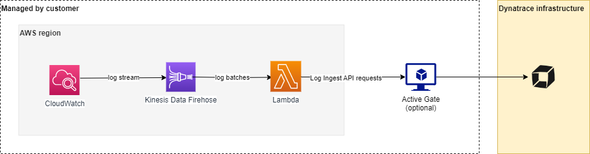

# Dynatrace AWS Log Forwarder

## Contributing

Please follow these steps:
1. Fork repository and apply your changes.
2. Create a PR to some feature branch in our repo (not to master!)
3. We will review your changes and pull them as our feature branch.
4. Then we will be able to run test pipeline on it, merge to our master and release. 

Thank you! 

## Overview
See the [official project documentation](https://www.dynatrace.com/support/help/technology-support/cloud-platforms/amazon-web-services/aws-log-forwarder/) for overview and user's manual. This readme contains only additional technical details.

### Architecture

CloudWatch Log Groups are subscribed to using Subscription Filters. Their target is Kinesis Data Firehose to which logs are streamed. It aggregates them into batches and sends those batches to a Lambda function for processing. The function processes the received logs and forwards them through Active Gate to Dynatrace Logs API.

Active Gate is required to forward logs to your Dynatrace cluster. You can run it in the same region as the AWS stack or anywhere else as long as you ensure connectivity (especially: open port 9999). In order to install an Active Gate, follow [this instruction](https://www.dynatrace.com/support/help/setup-and-configuration/dynatrace-activegate/installation/install-an-environment-activegate/).

## Advanced troubleshooting

**Debug EC2 ActiveGate installation**

First, check if ActiveGate is visible in UI (Deployment Status/Active Gates). Right now its label will be EC2's hostname (includes EC2's private IP).

If it is not visible, follow these steps to check AG installation logs:

1. Enable SSH traffic in EC2 Security Group.
2. Connect to EC2 through EC2 Instance Connect in EC2 screen in AWS Console. Use user `ec2-user`. You don't need any SSH keys in this scenario.
3. Check if file `/home/ec2-user/userdata-ag-installation-success` exists. If it does, installation was successful.
4. Check `/var/log/cloud-init-output.log` using sudo. You will find installation script logs there.
